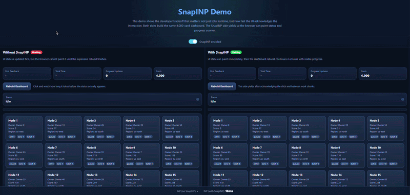

# SnapINP

[](https://www.npmjs.com/package/snapinp)
[](https://bundlephobia.com/package/snapinp)
[](https://www.typescriptlang.org/)
[](https://opensource.org/licenses/MIT)

**One line. Instant UI. Every interaction.**

SnapINP helps your app feel less frozen during expensive interactions by yielding to the browser between chunks of work.

It is designed to improve perceived responsiveness and [Interaction to Next Paint (INP)](https://web.dev/inp/), not to magically reduce total CPU work.

```bash
npm install snapinp
```

```typescript
import { snap } from "snapinp";
snap();
```

That's it. Your app can acknowledge clicks, inputs, and heavy UI updates sooner under load.

- npm package: [snapinp on npm](https://www.npmjs.com/package/snapinp)

## Demo

Watch the package in action:



- [Open demo GIF](./demo.gif)

## Why Use It?

- Show loading states and progress sooner during expensive interactions
- Reduce the "the UI froze when I clicked" feeling
- Improve INP without building your own scheduling layer
- Stay framework-agnostic and dependency-free

## See It In Action

- Local demo:

```bash
npm install
npm run build
python -m http.server 4174
```

Then open `http://127.0.0.1:4174/demo/index.html`.

---

## How It Works

When a user clicks a button, the browser needs to: run your JavaScript handler, update the DOM, and paint the result. If your handler takes too long, the browser can't paint — the UI feels frozen.

SnapINP helps in two ways:

1. `yieldToMain()` lets you intentionally pause between chunks of expensive work so the browser can paint.
2. `snap()` and `wrap()` help you apply that behavior with less manual plumbing.

The result is usually better responsiveness, even if total runtime is sometimes slightly higher.

## Quick Example

Before:

```typescript
button.addEventListener("click", async () => {
  setStatus("Loading...");
  const result = expensiveRender();
  showResult(result);
});
```

After:

```typescript
import { yieldToMain } from "snapinp";

button.addEventListener("click", async () => {
  setStatus("Loading...");
  await yieldToMain();
  const result = expensiveRender();
  showResult(result);
});
```

---

## API Reference

### `snap(options?): Disposable`

Auto-mode. Patches `addEventListener` to wrap interaction handlers.

```typescript
const { restore } = snap({
  threshold: 50,        // ms before yielding (default: 50)
  events: ["click"],    // which events to intercept (default: all interaction events)
  exclude: [".no-snap"], // CSS selectors to skip
  adaptive: true,       // back off when INP is already good (default: true)
  debug: false,         // structured debug logging (default: false)
});

// Undo all patches
restore();
```

### `wrap(fn, options?): fn`

Manual mode. Wrap a single function without global patching.

```typescript
import { wrap } from "snapinp";

const optimizedHandler = wrap(expensiveHandler, { threshold: 30 });
button.addEventListener("click", optimizedHandler);
```

### `yieldToMain(): Promise<void>`

Cooperative yield point. **This is the recommended approach** for optimal INP.

```typescript
import { yieldToMain } from "snapinp";

async function handleSearch(query: string) {
  updateSearchUI(query);        // instant visual feedback
  await yieldToMain();          // let the browser paint
  const results = search(query); // expensive work
  renderResults(results);
}
```

### `observe(callback): Disposable`

Observe INP metrics without any patching. Tree-shakes cleanly (<1KB).

```typescript
import { observe } from "snapinp";

const { disconnect } = observe((metric) => {
  console.log(`INP: ${metric.inp}ms on ${metric.target}`);
});
```

### `report(options?): INPReport`

Get aggregated INP metrics. Optionally beacon on page hide.

```typescript
import { report } from "snapinp";

const r = report({ beacon: "/api/vitals" });
console.log(`INP: ${r.inp}ms (${r.rating})`);
```

---

## Framework Guides

### React

For React apps, prefer `yieldToMain()` over `snap()` auto-mode to avoid state tearing:

```tsx
import { yieldToMain } from "snapinp";
import { startTransition } from "react";

function SearchBar() {
  const handleInput = async (e: React.ChangeEvent<HTMLInputElement>) => {
    const query = e.target.value;
    await yieldToMain();
    startTransition(() => setResults(search(query)));
  };

  return <input onChange={handleInput} />;
}
```

### Vue

SnapINP auto-mode works well with Vue — handlers are attached directly to elements:

```typescript
import { snap } from "snapinp";
snap(); // Works with v-on directives
```

### Svelte

Svelte compiles to direct `addEventListener` calls. Auto-mode works transparently:

```typescript
import { snap } from "snapinp";
snap();
```

### Angular

Load SnapINP AFTER Angular bootstraps (Zone.js patches addEventListener first):

```typescript
platformBrowserDynamic().bootstrapModule(AppModule).then(() => {
  import("snapinp").then(({ snap }) => snap());
});
```

### Vanilla JS

```html
<script src="https://unpkg.com/snapinp/dist/index.global.js"></script>
<script>SnapINP.snap();</script>
```

---

## Browser Support

| Browser        | Version | Notes                                    |
| -------------- | ------- | ---------------------------------------- |
| Chrome/Edge    | 90+     | Full support including `scheduler.yield`  |
| Firefox        | 95+     | Full support (MessageChannel fallback)    |
| Safari         | 15.4+   | Full support (MessageChannel fallback)    |
| Node.js / SSR  | Any     | Safe no-op — all functions return defaults |

---

## Honest Limitations

1. **Cannot fix synchronous long tasks.** If your click handler runs a 300ms `for` loop, SnapINP cannot interrupt it mid-execution. It *can* detect it and warn. Use `yieldToMain()` in an async handler to break up the work.

2. **Monkey-patching caveats.** `snap()` patches `EventTarget.prototype.addEventListener`. If another library patches it AFTER SnapINP, calling `restore()` will break that library's patch. Initialize SnapINP last, or use `wrap()` instead.

3. **Overhead budget.** The wrapper adds ~0.01ms per handler invocation (two `performance.now()` calls). For the vast majority of apps this is negligible, but measure in your specific case.

4. **INP measurement requires `PerformanceObserver` event timing.** Firefox and Safari have limited `interactionId` support. Metrics may be incomplete on non-Chromium browsers.

5. **It optimizes responsiveness, not raw throughput.** In some cases total elapsed time can be slightly higher because yielding adds coordination overhead.

---

## Comparison with Alternatives

| Feature                  | SnapINP       | web-vitals | Manual scheduling |
| ------------------------ | ------------- | ---------- | ----------------- |
| Auto-patches handlers    | Yes           | No         | No                |
| Observe-only mode        | Yes           | Yes        | No                |
| Cooperative yield helper | `yieldToMain` | No         | DIY               |
| Framework-agnostic       | Yes           | Yes        | Varies            |
| Bundle size              | <3KB          | ~2KB       | 0 (your code)     |
| Zero dependencies        | Yes           | Yes        | N/A               |

---

## Contributing

See [CONTRIBUTING.md](docs/CONTRIBUTING.md) for setup instructions, PR checklist, and coding conventions.

---

## License

[MIT](LICENSE)
